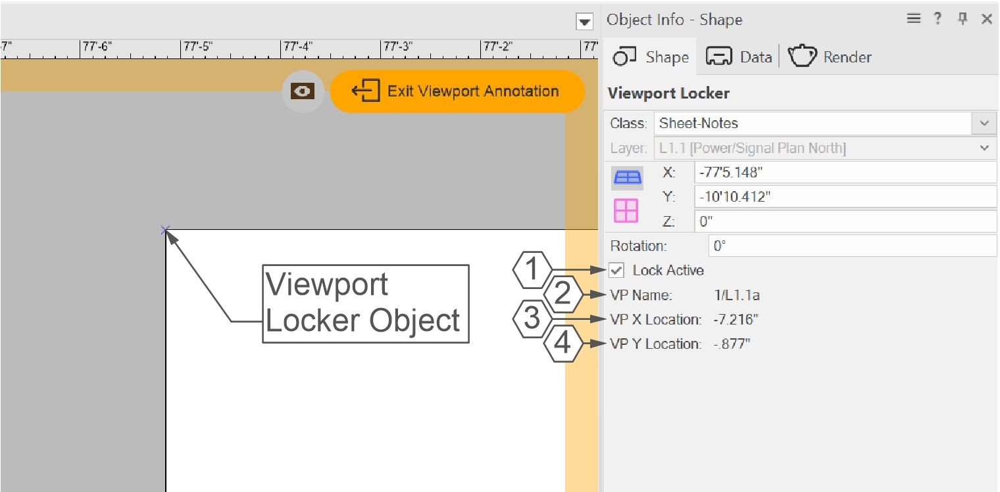
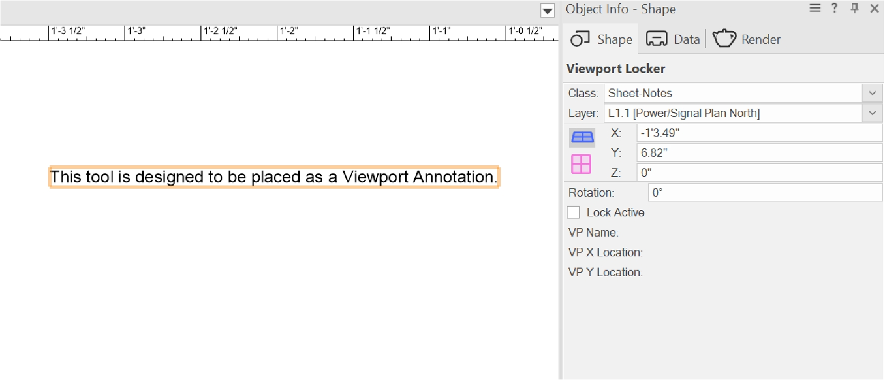
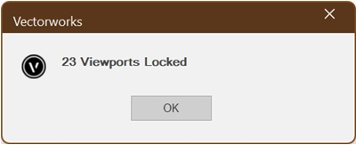
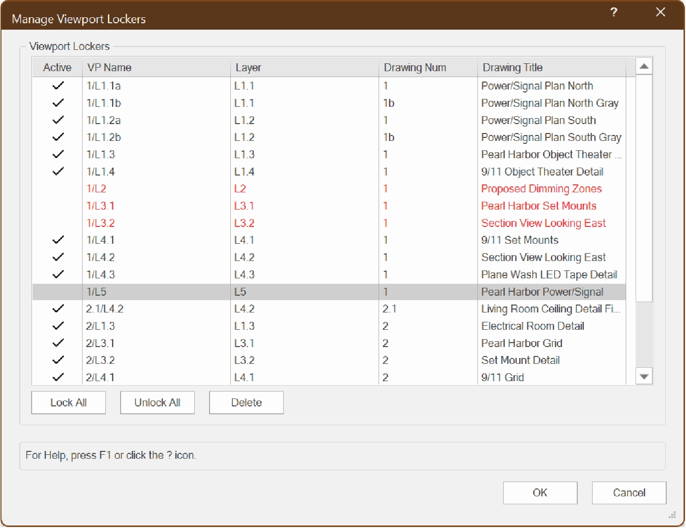

# Viewport Locker

Plug-in Object w/ Menu Commands

## Icon

## Version

**1.0.1** - 6/19/2026

These plug-ins are written in Vectorscript (Pascal) and can be used in any version of [Vectorworks](https://www.vectorworks.net) 2019 or newer.

## Description

The plug-in object is designed to be placed within a Sheet Layer Viewport's Annotation space and will allow the user to "lock" the Viewport in place. The object itself consists of a single 2D Locus and should not print or export. The object has a checkbox in the **Object Info Palette** that can be used to toggle whether the lock is active or inactive.

Associated menu commands can be used to lock, unlock, and delete **Viewport Locker** objects without needing to go into a Viewport's Annotation space.

## Instructions

1. Enter a Sheet Layer Viewport's Annotation space double-click **Edit Viewport** dialog or right-click **Edit Annotations** context menu.
1. Activate the **Place Viewport Locker** tool to place a **Viewport Locker** object anywhere within the Annotation space. The object's placement ultimately doesn't matter, but it's best to place the object within visible geometry to prevent the Viewport's bounding box from being larger than it needs to be.
1. Check the **Lock Active** parameter in the **Object Info Palette** to lock the Viewport in place.
1. Use the **Lock Viewports**, **Unlock Viewports**, and **Manage Viewport Lockers** menu commands to quickly lock, unlock, or delete **Viewport Locker** objects without needing to enter the Viewport Annotation space.

## Object Info Palette Parameters

1. **Lock Active**: Check this box to engage the Viewport lock.
1. **VP Name**: Name of the locked Viewport.
1. **VP X Location**: X axis Sheet Layer location of locked Viewport in document units.
1. **VP Y Location**: Y axis Sheet Layer location of locked Viewport in document units.

## Placement Outside of Viewport Annotation

If a **Viewport Locker** is placed outside of a Sheet Layer Viewport's Annotation space, instead of a 2D Locus the PIO will be a text box saying "*This tool is designed to be placed as a Viewport Annotation*".  All **Object Info Palette** values will be blank and the **Lock Active** checkbox will not be able to be checked.

## Supplemental Commands

### Lock Viewports

Running the **Lock Viewports** command will set **Lock Active** for all embedded **Viewport Locker** objects inside all selected Viewports. If no Viewports are selected when the command is run, all Viewports containing **Viewport Locker** objects will be locked.

A short Alert Dialog will display showing how many Viewports were locked in the operation.

**<u>To prevent this dialog</u>:**

1. Go to **Tools** -> **Plug-ins** -> **Plug-in Manager**.
1. Select the **Third-party plug-ins** tab.
1. Select the **Lock Viewports** command.
1. Press the **Customize** button.
1. Select the **Strings** tab.
1. Double-click the **4000 - Misc Strings** category.
1. Double-click the **4000** string.
1. Change the value to anything except "*True*"

### Unlock Viewports

The **Unlock Viewports** command works exactly the same as the **Lock Viewports** command but will uncheck **Lock Active** for all embedded **Viewport Locker** objects.

### Manage Viewport Lockers

Running the **Manage Viewport Lockers** command will open a dialog box showing information for all **Viewport Locker** objects in the active drawing. This allows the user to quickly lock, unlock, or delete **Viewport Locker** objects without needing to navigate through a Viewport's Annotation space.

- Placing a check in the **Active** column will set the associated **Viewport Locker** to **Active**.
- Press the **Lock All** button to set all **Viewport Lockers** to **Active**.
- Press the **Unlock All** button to set all **Viewport Lockers** to 
- Press the **Delete** button to mark all selected **Viewport Lockers** for deletion. Marked **Viewport Lockers** will have their information displayed in Red.
- Press **OK** to accept all changes and update / delete **Viewport Locker** objects.
- Press **Cancel** to close the dialog box without making changes to **Viewport Locker** objects.

## Installation Instructions

There are two methods of installation, direct download of the plug-ins or through the **JNC Tools Free Manager** plug-in.

### Direct Download:

1. Download source plug-in files:
    1. [Viewport Locker](Viewport%20Locker.vso) plug-in object
    1. [Place Viewport Locker](Place%20Viewport%20Locker.vst) tool
    1. [Lock Viewports](Lock%20Viewports.vsm) menu command
    1. [Unlock Viewports](Unlock%20Viewports.vsm) menu command
    1. [Manage Viewport Lockers](Manage%20Viewport%20Lockers.vsm) menu command
2. Place downloaded files inside the **Vectorworks User Folder** within the **Plug-ins** directory
3. Restart Vectorworks

### JNC Tools Free Manager

1. Run the [**JNC Tools Free Manager**](https://jncogs.github.io/JNC-Tools-Manager-Free/) menu command
2. Select the PIO, Tool, and Menu Commands within the **Viewport Locker** category:
    1. **Viewport Locker** PIO
    1. **Place Viewport Locker** Tool
    1. **Lock Viewports** Menu Command
    1. **Unlock Viewports** Menu Command
    1. **Manage Viewport Lockers** Menu Command
3. Press the **Install / Update** button
4. Press **Close** to close the dialog box
5. Restart Vectorworks

## Adding the Plug-in to your Workspace

1. Open the **Workspace Editor** by going to **Tools - Workspaces - Edit Current Workspace**
2. Select the **Tools** tab
3. In the box on the left, find and expand the **JNC** category
4. In the box on the right, find and expand a suitable tool set to place the tool in, such as **Basic** or **Dims / Notes**
5. Click and drag the **Place Viewport Locker** tool from the box on the left to the desired tool set in the box on the right
1. Select the **Menus** tab
1. In the box on the left, find and expand the **JNC** category
1. In the box on the right, find and expand a suitable menu to place the commands in, such as **View**
1. Click and drag the **Lock Viewports**, **Unlock Viewports**, and **Manage Viewport Lockers** commands from the box on the left to the desired menu in the box on the right.
6. Click **OK** to close the editor

## Localization Instructions

The plug-in can be localized to your native language without having access to the source code.  This can be achieved by following the instructions below:

1. Open the **Plug-in Manager** by going to **Tools - Plug-ins - Plug-in Manager**
2. Select the **Third-party Plug-ins** tab
3. Select the desired tool/command
4. Click the **Customize** button
5. Select the **Strings** tab
6. Double-click a category, such as **Dialog Strings**
7. Select a string to edit and press the **Edit** button
8. Write a new string and press the **OK** button until you are back to the **Plug-in Manager**

The categories for the plug-ins are as follows:

### Viewport Locker

- **3000** - *Record Strings*: These strings direct the code to the parametric record of the **Viewport Locker** object. These strings should not be changed.
- **4000** - *Misc Strings*: This category contains a single string, the value used for when a **Viewport Locker** is placed outside of a Viewport Annotation and can freely be changed.

### Place Viewport Locker

- **3000** - *Record Strings*: These strings direct the code to the parametric record of the **Viewport Locker** object and should not be changed.

### Lock Viewports

- **3000** - *Record Strings*: These strings direct the code to the parametric record of the **Viewport Locker** object and should not be changed.
- **4000** - *Misc Strings*: These strings are used to populate the Alert Dialog informing how many Viewports have been locked and can freely be changed. Changing the **4000** string to anything aside from "*True*" will prevent the Alert Dialog from launching.

### Unlock Viewports

- **3000** - *Record Strings*: These strings direct the code to the parametric record of the **Viewport Locker** object and should not be changed.
- **4000** - *Misc Strings*: These strings are used to populate the Alert Dialog informing how many Viewports have been locked and can freely be changed. Changing the **4000** string to anything aside from "*True*" will prevent the Alert Dialog from launching.

### Manage Viewport Lockers

- **3000** - *Record Strings*: These strings direct the code to the parametric record of the **Viewport Locker** object and should not be changed.
- **4000** - *Dialog Strings*: These strings are used in dialog box creation and can all freely be changed.
- **5000** - *Dialog Help Strings*: These strings are used to populate the **Help Box** at the bottom of the **Manage Viewport Lockers** dialog box and can all freely be changed.
- **6000** - *Misc Strings*: These strings fulfill a variety of purposes within the code. Only string **6002** should ever be changed.

## Release Notes

### Viewport Locker PIO
| Date | Version | Note |
| :---: | :---: | :--- |
| 06/18/2026 | 1.0.0 | Initial Release |

### Place Viewport Locker Tool
| Date | Version | Note |
| :---: | :---: | :--- |
| 06/18/2026 | 1.0.0 | Initial Release |
| 06/19/2026 | 1.0.1 | Added deselect to top of call |

### Lock Viewports Menu Command
| Date | Version | Note |
| :---: | :---: | :--- |
| 06/18/2026 | 1.0.0 | Initial Release |

### Unlock Viewports Menu Command
| Date | Version | Note |
| :---: | :---: | :--- |
| 06/18/2026 | 1.0.0 | Initial Release |

### Manage Viewport Lockers Menu Command
| Date | Version | Note |
| :---: | :---: | :--- |
| 06/18/2026 | 1.0.0 | Initial Release |
| 06/19/2026 | 1.0.1 | Fixed bug where deleted objects would linger until view change |

## Known Bugs

No Known Bugs

## Feature Requests

No current Feature Requests

## License

Copyright (c) Jesse Cogswell (JNC Tools)

Permission is hereby granted, free of charge, to any person or organization
obtaining a copy of this software (the "User") and associated documentation files (the "Software"),
to use, reproduce, distribute, execute, and transmit the Software.

The User is not permitted to modify or attempt to reverse engineer the source code.  The User may
localize the Software using approved methods from within the Vectorworks software.

THE SOFTWARE IS PROVIDED "AS IS", WITHOUT WARRANTY OF ANY KIND, EXPRESS OR
IMPLIED, INCLUDING BUT NOT LIMITED TO THE WARRANTIES OF MERCHANTABILITY,
FITNESS FOR A PARTICULAR PURPOSE, TITLE AND NON-INFRINGEMENT. IN NO EVENT
SHALL THE COPYRIGHT HOLDERS OR ANYONE DISTRIBUTING THE SOFTWARE BE LIABLE
FOR ANY DAMAGES OR OTHER LIABILITY, WHETHER IN CONTRACT, TORT OR OTHERWISE,
ARISING FROM, OUT OF OR IN CONNECTION WITH THE SOFTWARE OR THE USE OR OTHER
DEALINGS IN THE SOFTWARE.